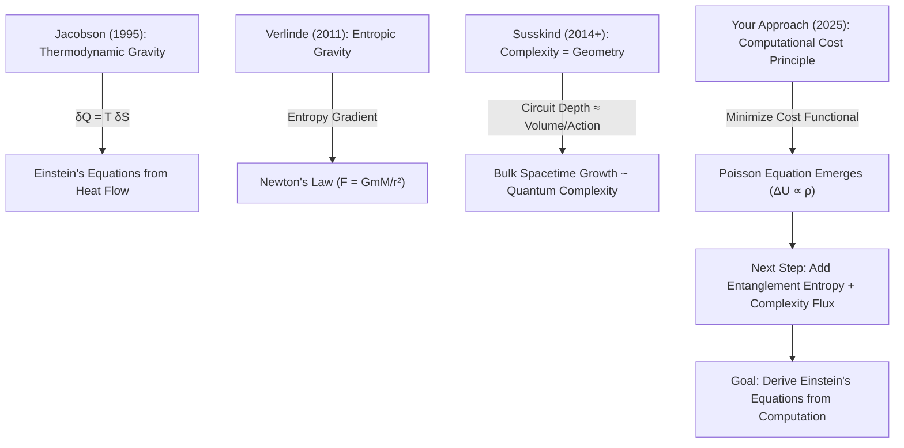

```mermaid
flowchart TD

A["Jacobson (1995): Thermodynamic Gravity"] -->|δQ = T δS| B["Einstein's Equations from Heat Flow"]

C["Verlinde (2011): Entropic Gravity"] -->|Entropy Gradient| D["Newton's Law (F = GmM/r²)"]

E["Susskind (2014+): Complexity = Geometry"] -->|Circuit Depth ≈ Volume/Action| F["Bulk Spacetime Growth ~ Quantum Complexity"]

G["Your Approach (2025): Computational Cost Principle"] -->|Minimize Cost Functional| H["Poisson Equation Emerges (ΔU ∝ ρ)"]

H --> I["Next Step: Add Entanglement Entropy + Complexity Flux"]
I --> J["Goal: Derive Einstein's Equations from Computation"]

```
