# 🌌 Information-Gravity Coupling Visualizer

**A Python-based numerical toy model for exploring how information erasure during galaxy formation may generate dark-matter-like gravitational effects.**  
Companion to: **“When the Universe Deletes Data, Gravity Remembers” (Gashash, 2025)**

---

## 🚀 Overview
This repository demonstrates how the **thermodynamic cost of information erasure** can lead to the emergence of a **gravitational halo**, mimicking dark matter without invoking exotic particles.  
The simulation links **information theory, energy, and gravity** into a single causal-response framework.

---

## 🧩 The Core Hypothesis

### 👻 The Ghost in the Galaxy
Galaxies rotate much faster than their visible matter allows. Traditional explanations invoke **dark matter particles**—none have been detected definitively.

### 💡 A New Perspective: *Information is Physical*
Information has energy costs. According to **Landauer’s Principle**, erasing one bit of information requires:

\[
E \ge k_B\,T\,\ln 2
\]

### 🔗 The Causal Link: From Erasure to Emergent Gravity
During galaxy formation, **information is erased** through:
- Coarse-graining (microscopic → macroscopic states)  
- Decoherence (quantum → classical reality)  
- Thermalization (ordered → chaotic states)  

A fraction **ζ** of the erasure energy may be stored in long-lived, “dark” modes that gravitate but do not shine.

---

## 🌀 Conceptual Flow

```mermaid
graph TD
A["Galaxy Formation (gas collapse, star formation, mergers)"] --> B{"Massive Information Erasure (coarse-graining, decoherence)"}
B --> C["Landauer's Principle: E = k_B T ln(2) per bit"]
C --> D{"Branching Ratio ζ"}
D -- "1 − ζ" --> E["Fast Thermalization (heat)"]
D -- "ζ" --> F["Slow, protected modes (long-lived energy reservoir)"]
F --> G["Gravitational influence (acts like extra mass)"]
G --> H["Observed galactic dynamics (flat rotation curves, strong lensing)"]
```

```mermaid
flowchart TD

A["Jacobson (1995): Thermodynamic Gravity"] -->|δQ = T δS| B["Einstein's Equations from Heat Flow"]

C["Verlinde (2011): Entropic Gravity"] -->|Entropy Gradient| D["Newton's Law (F = GmM/r²)"]

E["Susskind (2014+): Complexity = Geometry"] -->|Circuit Depth ≈ Volume/Action| F["Bulk Spacetime Growth ~ Quantum Complexity"]

G["Your Approach (2025): Computational Cost Principle"] -->|Minimize Cost Functional| H["Poisson Equation Emerges (ΔU ∝ ρ)"]

H --> I["Next Step: Add Entanglement Entropy + Complexity Flux"]
I --> J["Goal: Derive Einstein's Equations from Computation"]

```

